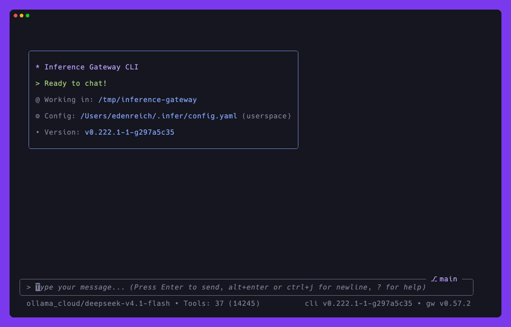

<div align="center">

# Inference Gateway CLI

[](https://golang.org)
[](LICENSE)
[](https://github.com/inference-gateway/cli/actions)
[](https://github.com/inference-gateway/cli/releases)

An agentic command-line assistant that writes code, understands project context, and uses tools to perform real tasks.

[📖 Documentation](https://docs.inference-gateway.com/cli) · [🚀 Quick Start](#quick-start) · [🧭 Features](#features) · [💬 Discussions](https://github.com/orgs/inference-gateway/discussions)

<br/>



*Plan mode fanning out 5 subagents, each live transcript one keypress away - [Subagents](docs/subagents.md)*

</div>

> **Early development stage**: breaking changes are expected until the project reaches a stable version.
> Always pin a specific version tag when downloading binaries or using install scripts.

## Installation

The recommended install is npm/npx - the matching native binary is fetched and cached on first use:

```bash
npx @inference-gateway/cli@latest chat
```

See **[Installation](docs/installation.md)** for production and CI installs, and **[Binary Verification](docs/binary-verification.md)** to verify a download.

## Quick Start

1. **Initialize the userspace baseline**:

```bash
infer init
```

This creates the shared `~/.infer/` configuration directory. All state (conversations, logs, history,
artifacts) lives there, and a project `.infer/` is an optional override layer you create with
`infer config set --project`.

2. **Set up your environment** (create a `.env` file):

```env
ANTHROPIC_API_KEY=your_key_here
OPENAI_API_KEY=your_key_here
DEEPSEEK_API_KEY=your_key_here
```

Provider keys resolve in this order, first hit wins: the system environment, the project `.env`, then the userspace
`~/.infer/auth.yaml` fallback - see [Provider API Keys](docs/configuration-reference.md#provider-api-keys).

3. **Start chatting**:

```bash
infer chat
```

## Features

One line per feature, each linking to its full guide:

### Core

- **Automatic gateway management** - downloads and runs the gateway binary, no Docker required - [Installation](docs/installation.md)
- **Interactive chat and headless agent** - model selection, streaming, session resumption, inline history auto-completion - [Commands Reference](docs/commands-reference.md)
- **Agent modes** - Standard, Plan, Auto-Accept and Auto+Judge, toggled with Shift+Tab - [Plan Mode](docs/plan-mode.md) · [Judge Mode](docs/judge-mode.md)
- **Tool execution** - every built-in tool the LLM can call, with parameters and approval defaults - [Tools Reference](docs/tools-reference.md)
- **Tool approval** - the gate in front of sensitive tools - [Tool Approval](docs/tool-approval.md)
- **Custom tools** - add tools in any language with one YAML manifest - [Custom Tools](docs/custom-tools.md)
- **MCP servers** - Model Context Protocol integration - [MCP Integration](docs/mcp-integration.md)
- **Subagents** - fan out parallel `infer headless` runs - [Subagents](docs/subagents.md)
- **GitHub issue references** - type `#` in chat to expand an issue inline (needs `gh` and a GitHub remote) - [Shortcuts Guide](docs/shortcuts-guide.md)
- **Cost tracking** - real-time per-model cost breakdown - [Cost Tracking](docs/cost-tracking.md)
- **Conversation history** - multiple storage backends - [Conversation Storage](docs/conversation-storage.md)
- **Conversation versioning** - navigate back in time to a previous point - [Conversation Versioning](docs/conversation-versioning.md)
- **Conversation titles** - AI-generated session titles - [Conversation Title Generation](docs/conversation-title-generation.md)
- **Configuration** - two-layer YAML plus `INFER_*` environment overrides - [Configuration Reference](docs/configuration-reference.md)
- **Directory structure** - what the CLI writes where, userspace and project side by side - [Directory Structure](docs/directory-structure.md)
- **Configurable keybindings and themes** - [Configuration Reference](docs/configuration-reference.md#keybinding-configuration)
- **Persistent memory** - cross-session Markdown facts with an injected index - [Persistent Memory](docs/memory.md)
- **Reminders and command hooks** - extension points at agent-loop hook points - [Reminders & Command Hooks](docs/hooks.md)
- **Telemetry** - OpenTelemetry traces and metrics - [Telemetry](docs/telemetry.md)
- **AG-UI output** - protocol event stream for the headless agent - [AG-UI Output](docs/ag-ui-output.md)

### Remote and automation

- **Web terminal** - browser-based, tabbed sessions - [Web Terminal](docs/web-terminal.md)
- **Remote messaging channels** - drive the agent from Telegram - [Channels](docs/channels.md)
- **Scheduled tasks** - cron prompts that deliver back through the channel - [Scheduling](docs/scheduling.md)
- **Heartbeat** - periodic wake-up to check pending work - [Heartbeat](docs/heartbeat.md)
- **A2A agents** - delegate to Agent-to-Agent servers - [A2A Agents Configuration](docs/agents-configuration.md) · [A2A Connections](docs/a2a-connections.md)
- **Task management** - the A2A task interface - [Tasks Management](docs/tasks-management.md)
- **Daemon** - the hub the desktop app, the extension and Telegram reach the agent through - [infer daemon](docs/daemon.md)
- **Daemon binding** - the WebSocket wire contract, including browser use through the extension - [Daemon Binding Protocol](docs/browser-extension-protocol.md)
- **Explorer and diffs** - in-terminal file tree, fuzzy finder and diff viewer - [Explorer](docs/explorer.md)

### Skills and plugins

- **Agent Skills** - drop-in `SKILL.md` instruction folders - [Agent Skills](docs/skills.md)
- **Plugins** - Claude Code-format skills plus an always-on ruleset - [Plugins](docs/plugins.md)
- **Extensible shortcuts** - custom `/`-commands with AI-powered snippets - [Shortcuts Guide](docs/shortcuts-guide.md)

### Media and computer use

- **Computer Use** - drive the desktop: mouse, keyboard, screenshots - [Computer Use](docs/computer-use.md)
- **Frame sources and vision annotation** - let text-only models "see" - [Vision](docs/vision.md)
- **Image generation, edit and variation** - written to the session artifacts dir - [Tools Reference](docs/tools-reference.md#media-tools)
- **Speech-to-text** - dictate with Whisper, locally and offline - [Speech-to-Text](docs/speech-to-text.md)
- **Text-to-speech** - local WAV synthesis with zero-shot voice cloning - [Text-to-Speech](docs/text-to-speech.md)
- **Text-to-music and text-to-video** - generate audio and video through the gateway - [Text-to-Music](docs/text-to-music.md) · [Text-to-Video](docs/text-to-video.md)

## Examples

Each directory under [`examples/`](examples/) is a self-contained, runnable setup. See
**[Examples](docs/examples.md)** for the full index and common workflows, or jump straight to
[basic](examples/basic/) for a minimal gateway plus CLI.

## Contributing

Development is documented in **[CONTRIBUTING.md](CONTRIBUTING.md)**. Coding agents working in this repository
should read **[AGENTS.md](AGENTS.md)** first; packages with their own agent-specific rules ship an `AGENTS.md`
next to the code.

## License

Apache 2.0 License - see the [LICENSE](LICENSE) file for details.
